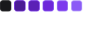
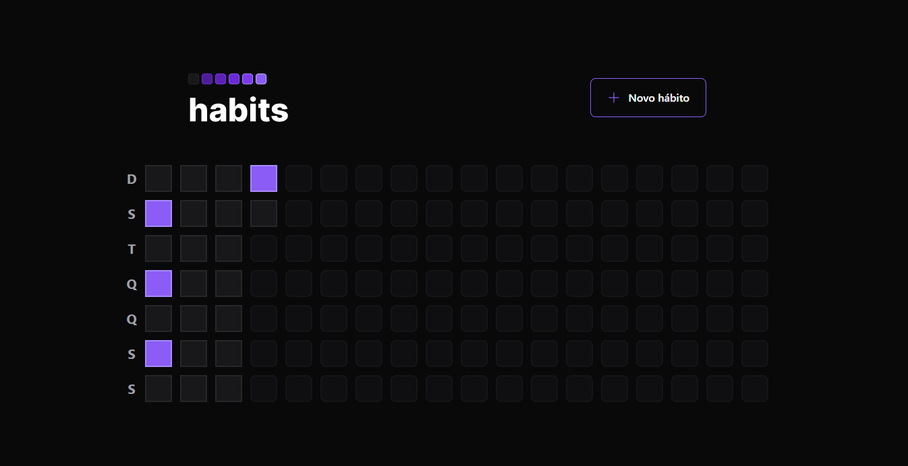
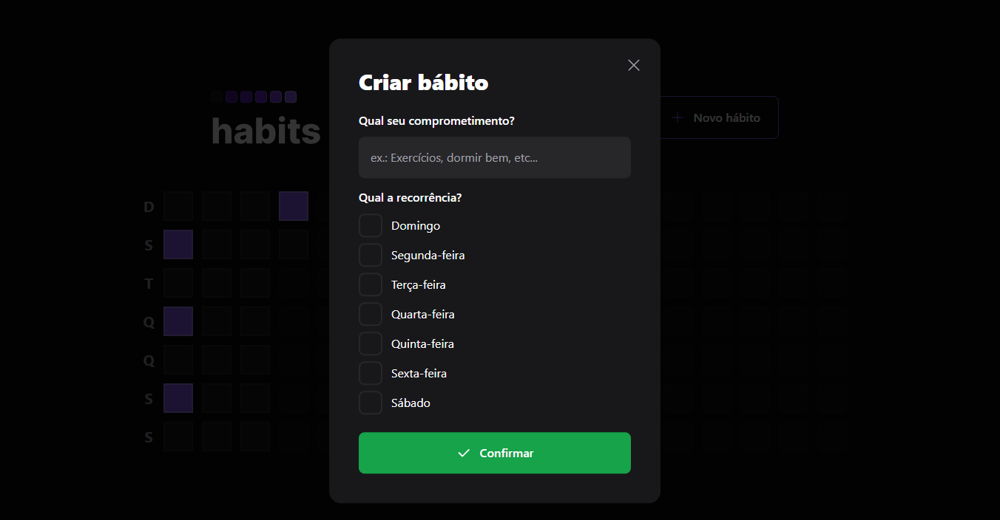
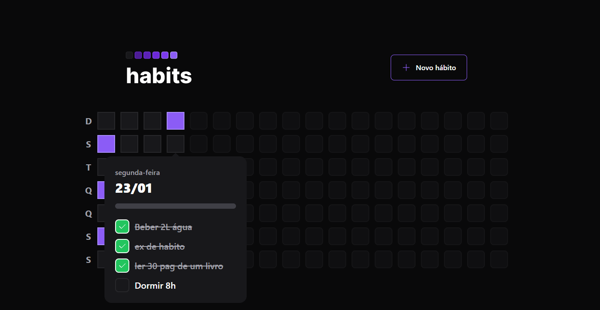

<div id="topo"></div>
 <!-- LOGO E/OU BANNER -->
<h1 align='center'>
    
</h1>

<!-- PROJECT SUBTITLE / SHORT DESCRIPTION -->
<h2 align='center' >Acompanhe seus hábitos e mantenha a motivação de Ano Novo!</h2>

<!-- CITAÇÃO OU FRASE QUE TENHA RELAÇÃO COM A PROPOSTA DO PROJETO 
<p align="center"><i>“ALGUMA FRASE LEGAL" ~AUTOR (ANO)</i> </p>
-->
<!-- BADGES -->
<div align="center">
<!-- BADGE v18.13.0 -->
    
<!-- BADGE 9.3.0 -->
    
<!-- BADGE PRs -->
    
<!--BADGE LICENÇA -->
    
<!-- BADGE REPO SIZE -->
    
<!-- BADGE TOP LANGUAGE -->
    
<!-- BADGE LAST COMMIT -->
    

</div>

<!-- LINKS DE DEMONSTRAÇÃO E README 
<h3 align='center'>:link:<a href='LINK DA DEMONSTRAÇÃO' target='_blank'> Acessar a demonstração (Vercel)</a></h3>
<h4 align="center">:us::gb: <a href="./README-en.md">Go to the English version of this README »</a>
</h4>
-->
<!-- SUMÁRIO / TABELA DE CONTEÚDOS -->
<details>
    <summary>Sumário</summary>
    <ol>
        <li><a href="#pushpin-sobre">Sobre</a></li>
        <li><a href="#camera-screenshots-do-projeto">Screenshots do projeto</a></li>
        <li><a href="#hammer_and_wrench-funcionalidades">Funcionalidades</a></li>
        <li><a href="#wrench-tecnologias-e-recursos-utilizados">Tecnologias e recursos utilizados</a></li>
        <li><a href="#computer-como-baixar-e-rodar-o-projeto">Como baixar e rodar o projeto</a>
            <ul>
                <li><a href="#bulb-pré-requisitos">Pré requisitos</a></li>
            </ul>
        </li>
        <li><a href="#woman_technologist-a-desenvolvedora">A desenvolvedora</a></li>
    </ol>
</details>

<!-- DESCRIÇÃO LONGA -->
## :pushpin: Sobre
Habits é uma plataforma que ajuda o usuário a acompanhar o progresso dos seus hábitos e o motiva a continuar seguindo-os. O design foi inspirado no gráfico de contribuições do GitHub.

Esse projeto foi desenvolvido durante a NLW Setup - Trilha Ignite, que aconteceu entre os dias 16 e 23 de janeiro de 2023, evento organizado e ministrado pela @rocketseat, @diego3g e @rodrigorgtic.

O layout no Figma pode ser acessado [aqui](https://www.figma.com/community/file/1195326661124171197).

<!-- SCREENSHOTS / GIFS DO PROJETO -->
## :camera: Screenshots do projeto
<h3>Home</h3>
<div align="center">
    
</div>
<h3>Adicionar novo hábito</h3>
<div align="center">
    
</div>
<h3>Lista de hábitos do dia</h3>
<div align="center">
    
</div>


<!-- BOTÃO PARA VOLTAR AO TOPO DA PÁGINA -->
<p align="right"><a href="#topo"></a></p>

<!-- FUNCIONALIDADES JÁ IMPLEMENTADAS E A IMPLEMENTAR -->
## :hammer_and_wrench: Funcionalidades
- [x] Criação de novos hábitos
- [x] Detalhes do dia (hábitos completos/possíveis)
- [x] Toggle do hábito do dia
- [x] Tabela de hábitos diários
- [x] Mostra o progresso dos hábitos diários
- [x] Conexão com a API
- [x] Lista possíveis hábitos do dia
- [x] Toggle desabilitado em datas passadas

### To do
- [ ] Autenticação (Firebase, Auth0)
- [ ] Notificações Push/Service Workers
- [ ] Perfil público com gráfico de resumo

<!-- BOTÃO PARA VOLTAR AO TOPO DA PÁGINA -->
<p align="right"><a href="#topo"></a></p>

<!-- LINKS PARA LINGUAGENS / FRAMEWORKS / BIBLITECAS / RECURSOS / TECNOLOGIAS UTILIZADAS NO PROJETO -->
## :wrench: Tecnologias, bibliotecas e recursos utilizados

- [TypeScript](https://www.typescriptlang.org)
- [Phosphor Icons](https://phosphoricons.com)
- [Google Fonts](https://fonts.google.com/specimen/Inter)
- [clsx](https://www.npmjs.com/package/clsx)
- [NPM](https://www.npmjs.com)

### Server
- [Node.js](https://nodejs.org/en/)
- [Fastify](https://www.fastify.io)
- [Prisma](https://www.prisma.io)
    - [Prisma Studio](https://www.prisma.io/studio)
    - [Prisma ERD generator](https://www.npmjs.com/package/prisma-erd-generator)
- [SQLite](https://www.sqlite.org/index.html)
- [CORS](https://developer.mozilla.org/en-US/docs/Web/HTTP/CORS)

### Web
- [React](https://reactjs.org)
- [Vite](https://vitejs.dev)
- [TailwindCSS](https://tailwindcss.com)
- [PostCSS](https://postcss.org)
- [Autoprefixer](https://www.npmjs.com/package/autoprefixer)
- [Zod](https://www.npmjs.com/package/zod)
- [Day.js](https://day.js.org)
- [Radix UI](https://www.radix-ui.com)

### Mobile
- [React Native](https://reactnative.dev)
- [Expo](https://expo.dev)
- [Expo Go](https://expo.dev/client)
- [Nativewind](https://www.nativewind.dev)
- [react-native-svg](https://www.npmjs.com/package/react-native-svg)
    - [react-native-svg-transformer](https://www.npmjs.com/package/react-native-svg-transformer?activeTab)
- [React Navigation](https://reactnavigation.org)
- [React Native Reanimated](https://docs.swmansion.com/react-native-reanimated/)


### Ferramentas de desenvolvimento
- [Figma](https://www.figma.com)
- [Insomnia](https://insomnia.rest/download)
- [Extensão JSON Lite (Opera)](https://addons.opera.com/en/extensions/details/json-lite/)
- [VSCode](https://code.visualstudio.com)

#### Extensões do VSCode recomendadas
- [Tema: Rosé Pine](https://marketplace.visualstudio.com/items?itemName=mvllow.rose-pine)
- [Tailwind CSS IntelliSense](https://marketplace.visualstudio.com/items?itemName=bradlc.vscode-tailwindcss)
- [DotENV](https://marketplace.visualstudio.com/items?itemName=mikestead.dotenv)
- [Prisma](https://marketplace.visualstudio.com/items?itemName=Prisma.prisma)
- [Fluent Icons](https://marketplace.visualstudio.com/items?itemName=miguelsolorio.fluent-icons)
- [Symbols](https://marketplace.visualstudio.com/items?itemName=miguelsolorio.symbols)
- [Console Ninja](https://marketplace.visualstudio.com/items?itemName=WallabyJs.console-ninja)

#### Configurações do VSCode do @diego3g
- [settings.json](https://gist.github.com/diego3g/b1b189063d21b96d6144ca896755be64)
- Para configurar a extensão do Prisma:

    - ```CTRL + SHIFT + P```
    - ```Open User Settings (JSON)```
    - Adicione o seguinte código no arquivo:
```json
"[prisma]": {
"editor.defaultFormatter": "Prisma.prisma",
"editor.formatOnSave": true
},
```


<!-- BOTÃO PARA VOLTAR AO TOPO DA PÁGINA -->
<p align="right"><a href="#topo"></a></p>

<!-- INSTRUÇÕES DE COMO BAIXAR E RODAR O PROJETO, BEM COMO OS PRÉ REQUISITOS PARA TAL -->
## :computer: Como baixar e rodar o projeto

### :bulb: Pré requisitos

Antes de começar, você vai precisar ter instalado em sua máquina as seguintes ferramentas:
[Git](https://git-scm.com) e [Node.js](https://nodejs.org/en/). 

Além disso, é bom ter um editor para trabalhar com o código como o [VSCode](https://code.visualstudio.com/).

```bash
# Clonar o repositório
$ git clone https://github.com/Carol42/habits

# Entrar no diretório do Servidor
$ cd habits/server

OU

# Entrar no diretório Web
$ cd habits/web

# Instalar as dependências
$ npm install

# Iniciar o projeto
$ npm run dev
```
\* Note que para a aplicação rodar adequadamente é preciso ter tanto o Server como a interface Web rodando simultaneamente.

<!-- BOTÃO PARA VOLTAR AO TOPO DA PÁGINA -->
<p align="right"><a href="#topo"></a></p>

<!-- INFORMAÇÕES SOBRE A DESENVOLVEDORA -->
## :woman_technologist: A desenvolvedora


</br>
<strong>Caroline Heloíse de Oliveira</strong>
</br>
<sup>Estudante de Engenharia de Computação (UEPG)</sup>
</br>

<a href="https://github.com/Carol42"></a>
<a href="https://linkedin.com/in/carol42"></a>
<a href="mailto:carol42.helo@gmail.com"></a>

<!-- BOTÃO PARA VOLTAR AO TOPO DA PÁGINA -->
<p align="right"><a href="#topo"></a></p>